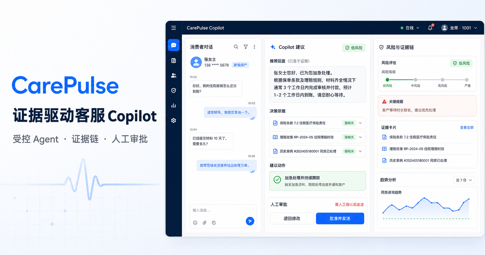
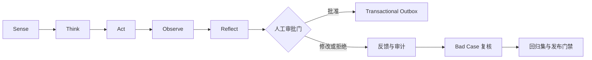
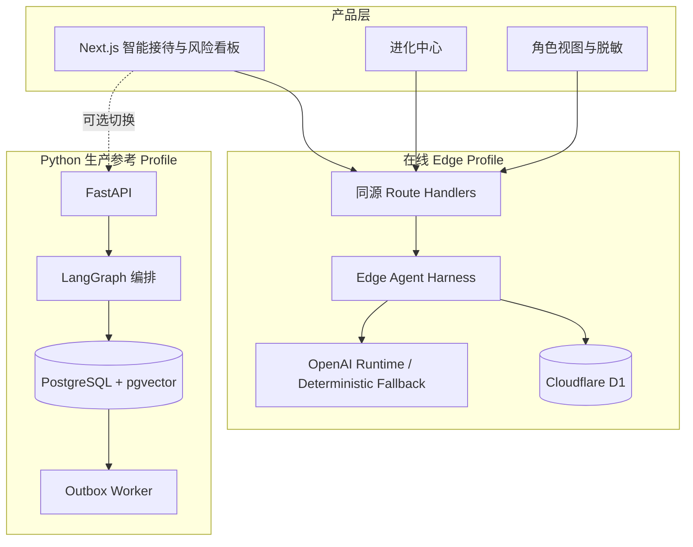

<div align="center">
  

  <h1>LumiSense 感光</h1>

  <p><strong>面向美妆客服场景的 AI 共情管家与消费者风险决策系统</strong></p>
  <p>让 AI 从“辅助回答”升级为“辅助共情”，让每一次建议都可解释、可审批、可回放、可进化。</p>

  <p>
    
    
    
    
    
    
  </p>

  <p>
    <a href="https://lumisense-empathy-v2.blunder-dancing-3p.chatgpt.site/"><strong>在线体验</strong></a>
    ·
    <a href="./docs/lumisense-v2-prd-coverage.md">PRD 落实清单</a>
    ·
    <a href="./docs/requirements-coverage.md">Harness 工程说明</a>
  </p>
</div>



---

## 目录

- [项目简介](#项目简介)
- [核心能力](#核心能力)
- [产品使用流程](#产品使用流程)
- [Agent Harness](#agent-harness)
- [系统架构](#系统架构)
- [技术栈](#技术栈)
- [项目结构](#项目结构)
- [快速开始](#快速开始)
- [环境配置](#环境配置)
- [API 接口](#api-接口)
- [角色与权限](#角色与权限)
- [测试与验证](#测试与验证)
- [部署方案](#部署方案)
- [安全边界](#安全边界)
- [项目文档](#项目文档)

---

## 项目简介

传统客服 Copilot 通常只解决一个问题：**“这一句话该怎么回？”**

LumiSense 把消费者画像、订单证据和完整多轮会话组织成一个可回放的运行对象，进一步回答：

- 消费者当前真正面临什么风险？
- 情绪从哪一轮开始发生转折，根因是什么？
- 未来三轮可能如何发展，怎样降低升级与流失概率？
- 建议依据来自哪里，是否触碰产品安全和医学表达边界？
- 哪些动作需要人工批准，哪些 bad case 应进入复核与回归集？

产品核心闭环：

```text
Sense 感知 → Respond 回应 → Resolve 解决 → Measure 衡量
```

LumiSense 的技术重点不是堆叠 Agent，而是将**多轮时序分析、证据检索、安全规则、人工审批、运行追踪和反馈治理**收敛到一条清晰链路中。

### 项目定位

| 维度 | 说明 |
| --- | --- |
| 服务对象 | 美妆品牌客服、客服主管、AI 管理员与风险运营人员 |
| 核心输入 | 消费者画像、业务场景、订单证据、产品信息、完整多轮会话 |
| 核心输出 | 风险预警、情绪因果诊断、未来路径预测、可编辑共情建议、证据与安全结论 |
| 决策方式 | AI 生成建议，人类完成最终确认；高风险副作用必须经过审批门 |
| 差异化能力 | 情绪考古师、情绪预言家、消费者风险雷达、可审计 Agent Harness、自进化治理闭环 |

---

## 核心能力

### 1. 智能接待工作台

- 自定义消费者姓名、肤质、性格、品牌、场景、核心诉求和订单证据
- 支持录入完整多轮会话，而不只分析单条消息
- 情绪、皮肤状态、产品与成分信号三轴实时感知
- 生成两条可编辑共情建议，可一键填入人工回复区
- 对高风险不良反应默认禁止销售推荐，优先给出安全处置方向
- 运行状态明确区分 `LIVE MODEL + HARNESS`、`EDGE HARNESS ONLINE` 和 `DEMO PREVIEW`

内置五个可直接演示的典型场景：

| 场景 | 主要挑战 | 默认策略 |
| --- | --- | --- |
| 过敏急救 | 急性不良反应与安全升级 | 停用提示、证据核验、人工接管，不做销售推荐 |
| 孕期安全 | 成分禁忌与表达边界 | 基于规则与证据回答，拒绝医学诊断 |
| 爆痘投诉 | 产品体验、情绪升级、归因不确定 | 承认体验、排查使用路径、避免武断归因 |
| 送礼推荐 | 需求模糊与品牌匹配 | 补充偏好后给出主推荐与替代方案 |
| 效果落差 | 预期管理与信任修复 | 回溯历史承诺，优先修复服务失信 |

### 2. 消费者风险预警

风险看板关注的是**消费者可能遭遇或引发的风险**，不是对客服人员进行简单告警。

| 风险维度 | 典型信号 |
| --- | --- |
| 产品安全 | 刺痛、红肿、过敏史、孕期成分顾虑、异常使用组合 |
| 情绪失控 | 愤怒持续上升、反复否定、沟通中断倾向 |
| 流失倾向 | 明确退订、拒绝复购、品牌信心下降 |
| 投诉舆情 | 投诉、曝光、平台申诉、公开传播意图 |
| 服务失信 | 多次联系、历史承诺未兑现、补发或回访逾期 |

看板提供 30 条确定性风险事件、风险分、情绪轨迹、重复联系次数、SLA、负责人、处置状态和人工接管入口。查看者角色自动获得脱敏数据。

### 3. 情绪考古师

情绪考古师以整段会话为输入，执行单条消息 Prompt 无法稳定完成的多轮时序因果分析：

1. 对齐每轮会话和情绪分数；
2. 定位显著情绪转折点；
3. 连接转折前后的产品、承诺和服务证据；
4. 生成根因链与处方建议；
5. 证据不足时明确拒绝伪因果。

> “潜台词翻译”保留为实时建议栏中的辅助能力，不作为主要技术亮点。

### 4. 情绪预言家

根据已观察到的多轮轨迹，输出未来三轮可能出现的 A / B / C 路径、挽回概率、风险变化和推荐应对方向。预测结果与实际后续反馈可进入评估闭环。

### 5. 受治理的自进化

LumiSense 不宣称模型会在生产流量中自行修改权重。“自进化”具体指：

```text
真实反馈或公开经验
  → 经验复用性判断
  → 与 SkillBank 最近邻比较
  → CREATE / MERGE / DISCARD
  → 版本化 Skill 候选
  → 影子评测 + 60 条既有回归
  → 人工 Promotion
  → 上线、审计与回滚
```

所有反馈写操作同步进入审计日志，记录角色、Trace ID 和复核状态。脏数据不能绕过人工复核直接进入训练候选；公开数据也只形成候选，未批准版本不会进入 Harness 主链路。

进化中心内置一条可复现的公开数据闭环：从 [Sephora Product Reviews（CC0-1.0）](https://www.kaggle.com/datasets/zeeenb/sephora-product-reviews) 的 1,232 条视黄醇面霜评论中，按明确规则抽取 3 条已去身份化的一星安全信号记录。中文基线在该英文切片上的召回为 `0/3`，候选 Skill 为 `3/3`，并保持既有工程回归 `60/60`。这只是定向工程切片，不是商业效果或泛化能力声明。

Skill 机制参考 [AutoSkill](https://arxiv.org/abs/2603.01145) 的经验抽取、混合检索和 add / merge / discard 双循环，同时补上论文未验证充分的生产治理：来源绑定、不可变版本、影子评测、人工发布门、审计和回滚。完整审阅见 [`docs/autoskill-paper-card.md`](./docs/autoskill-paper-card.md)。

---

## 产品使用流程

1. 进入“智能接待”，点击“自定义消费者与场景”。
2. 填写消费者画像、业务上下文、订单证据与多轮会话。
3. 点击“运行场景”，输入被提交到在线 Edge Harness 或已配置的 Python Profile。
4. 查看消费者风险、情绪考古、未来路径、证据卡和独立 Review。
5. 采纳或编辑回复；赔付、升级等副作用必须经过人工审批门。
6. 对建议提交“准确 / 部分准确 / 需修正”反馈。
7. 切换到“AI 管理员”或“客服主管”，进入“进化中心”。
8. 在 Bad Case 复核台修正并批准训练候选，随后运行 60 条回归案例验证版本。
9. 在“公开数据 × AutoSkill”实验区点击“运行完整闭环”，核对来源、MERGE 决策、版本差异和影子指标，再由人工点击“批准发布”。
10. 发布后回到智能接待输入英文不良反应描述，Trace 会明确记录 `skill:product-safety-triage@1.1.0`；候选未发布时不会命中。

“Harness 重跑此场景”不是刷新页面，而是将当前完整输入重新提交给状态机，创建一个新的、可回放和可审计的 Run。

---

## Agent Harness

### 运行状态机



### 各阶段职责

| 阶段 | 核心职责 | 主要产物 |
| --- | --- | --- |
| Sense | 解析消费者、会话、产品与风险信号 | 三轴感知、风险类型、证据需求 |
| Think | 时序推理、证据检索、候选策略生成 | 根因链、预测路径、候选回复 |
| Act | 生成受约束的客服建议 | 可编辑回复、升级或赔付建议 |
| Observe | 独立复核输出质量与安全 | Review、评分、回退原因 |
| Reflect | 记录结果与反馈入口 | Trace、Bad Case、训练候选 |

### Harness 的工程体现

- 每次运行拥有唯一 `run_id` 与 `trace_id`
- SSE / AGUI 风格事件持续返回节点进度
- Triage、Copilot、Review 使用独立结构化结果契约
- 模型缺失、超时、解析失败或校验失败时整轮进入确定性回退
- 安全规则、成分禁忌、证据服务和审批门独立于模型
- Agent 不直接执行外部副作用，批准后的动作进入 Transactional Outbox
- 前端可重跑、回放并展示模型模式、延迟、证据和安全状态

---

## 系统架构



### 双运行 Profile

| Profile | 适用场景 | 数据与运行方式 |
| --- | --- | --- |
| Edge Profile | 在线演示、比赛评审、低运维部署 | Cloudflare Worker + D1 + 同源 Edge Harness |
| Python Profile | 生产化参考、独立 Worker、PostgreSQL 持久化 | FastAPI + LangGraph + PostgreSQL/pgvector + Outbox Worker |
| Demo Preview | 无在线模型或主动关闭 API 时 | 确定性结构化数据，界面明确标记为预览 |

---

## 技术栈

| 层级 | 技术 |
| --- | --- |
| Web 框架 | Next.js 16、React 19、Vinext、Vite 8 |
| UI 与可视化 | Ant Design 6、ECharts 6、Tailwind CSS 4 |
| Edge 运行时 | Cloudflare Workers、OpenAI Sites |
| Edge 数据 | Cloudflare D1、Drizzle ORM |
| AI 运行时 | OpenAI 模型接口、严格 JSON Schema、确定性回退 |
| Python API | Python 3.11+、FastAPI、Pydantic、Uvicorn |
| Agent 编排 | LangGraph、PostgreSQL Checkpoint |
| 生产数据 | PostgreSQL 16、pgvector、SQLAlchemy、Alembic |
| 身份与审计 | JWT、服务端 RBAC、Audit Log、Trace ID |
| 可观测性 | Structlog、Prometheus、OpenTelemetry |
| 测试与质量 | Node Test Runner、Pytest、Ruff、ESLint |

---

## 项目结构

```text
lumisense/
├─ app/
│  ├─ api/                         # 同源 Edge API
│  │  ├─ health/                   # 健康检查
│  │  ├─ internal/outbox/          # Outbox 内部处理入口
│  │  └─ v1/                       # Runs、风险、反馈、评估、管理接口
│  ├─ components/                  # 图表、权限门、品牌标识等共享 UI
│  ├─ features/
│  │  ├─ shell/                    # 导航、角色与页面组合
│  │  ├─ workbench/                # 薄组合根、展示组件、控制 Hook、场景配置
│  │  ├─ risk/ growth/             # 产品能力垂直切片
│  │  ├─ evolution/                # 反馈复核与进化中心
│  │  ├─ harness/                  # 类型化客户端、Run 编排、模型适配器
│  │  ├─ actions/ analytics/       # 审批 Outbox 与持久化看板
│  │  └─ skill-evolution/          # 纯 Skill domain + D1 Promotion 服务
│  ├─ lib/                         # 兼容 facade；不再承载业务实现
│  ├─ page.tsx                     # 薄 Next.js 页面入口
│  ├─ styles/                      # foundation、工作台、洞察、风险、成长、进化样式域
│  ├─ globals.css                  # 仅声明样式加载顺序
│  └─ layout.tsx                   # 站点元数据
├─ backend/
│  ├─ app/
│  │  ├─ main.py                   # FastAPI 入口
│  │  ├─ harness.py                # Agent Harness
│  │  ├─ orchestrator.py           # 编排逻辑
│  │  ├─ retrieval.py              # 证据检索
│  │  ├─ services.py               # 领域服务
│  │  ├─ auth.py                   # JWT 与 RBAC
│  │  ├─ sql_store.py              # PostgreSQL 持久化
│  │  └─ outbox_worker.py          # 独立副作用 Worker
│  ├─ alembic/                     # PostgreSQL 迁移
│  └─ tests/                       # Python 测试
├─ db/ + drizzle/                  # D1 Schema 与迁移
├─ docs/                           # PRD 覆盖和工程验收文档
├─ public/                         # 品牌与分享图片
├─ scripts/                        # 在线模型 Smoke Test
├─ tests/                          # Edge Harness 与 SSR 测试
├─ worker/                         # Cloudflare Worker 入口
├─ .openai/hosting.json            # Sites 项目和 D1 绑定
├─ docker-compose.yml              # PostgreSQL、API、Worker
└─ package.json                    # Web 命令与依赖
```

---

## 快速开始

### 环境要求

- Node.js `>= 22.13`
- npm
- 可选：Python `>= 3.11`
- 可选：Docker 与 Docker Compose

### 1. 启动在线同构版本

```bash
git clone https://github.com/royd132/lumisense.git
cd lumisense
npm install
cp .env.example .env.local
npm run dev
```

默认使用站点内置的同源 Edge Harness。未配置模型密钥时会进入确定性回退，并在界面中明确显示运行模式。

### 2. 启用在线模型

编辑 `.env.local`：

```env
OPENAI_API_KEY=your_api_key
OPENAI_MODEL=gpt-5.6-luna
NEXT_PUBLIC_CAREPULSE_API_ENABLED=true
```

### 3. 连接 Python Profile

```bash
cd backend
pip install -e ".[dev]"
uvicorn app.main:app --reload --port 8000
```

在 Web 项目的 `.env.local` 中设置：

```env
NEXT_PUBLIC_CAREPULSE_API_URL=http://localhost:8000
NEXT_PUBLIC_CAREPULSE_API_ENABLED=true
```

### 4. 启动完整生产参考栈

```bash
export CAREPULSE_JWT_SECRET="replace-with-a-long-random-secret"
docker compose up --build
```

该命令启动 PostgreSQL、FastAPI 与独立 Outbox Worker。

---

## 环境配置

| 变量 | 默认值 | 说明 |
| --- | --- | --- |
| `NEXT_PUBLIC_CAREPULSE_API_URL` | 空 | 空值使用同源 Edge Harness；填写后连接 Python Profile |
| `NEXT_PUBLIC_CAREPULSE_API_ENABLED` | `true` | 设为 `false` 时强制使用确定性演示数据 |
| `OPENAI_API_KEY` | 空 | 在线模型密钥；禁止提交到版本库 |
| `OPENAI_MODEL` | `gpt-5.6-luna` | Hosted Edge Harness 使用的模型 |
| `CAREPULSE_DEMO_MODE` | `true` | Python Profile 的演示模式开关 |
| `CAREPULSE_CORS_ORIGINS` | 本地地址 | Python API 允许的浏览器来源 |
| `DATABASE_URL` | 本地 PostgreSQL | Python Profile 数据库连接 |
| `CAREPULSE_JWT_SECRET` | 无安全默认值 | 非演示环境必须设置高强度随机值 |

> `.env*` 已默认忽略，仅 `.env.example` 会进入版本控制。

---

## API 接口

### 运行与事件

| 方法 | 路径 | 说明 |
| --- | --- | --- |
| `POST` | `/api/v1/runs` | 创建异步 Agent Harness Run |
| `GET` | `/api/v1/runs/{run_id}/events` | 订阅 SSE / AGUI 风格节点事件 |
| `GET` | `/api/v1/runs/{run_id}` | 获取完整结构化分析结果 |
| `POST` | `/api/v1/cases/{case_id}/approval` | 批准或拒绝受控动作 |

### 产品与风险

| 方法 | 路径 | 说明 |
| --- | --- | --- |
| `GET` | `/api/v1/lumisense/bootstrap` | 获取产品、角色、场景和冷启动数据 |
| `GET` | `/api/v1/risk/dashboard` | 服务端 RBAC 风险看板；Viewer 自动脱敏 |
| `GET` | `/api/v1/evaluation` | 在线复算 60 条工程回归案例 |

### 反馈与进化

| 方法 | 路径 | 说明 |
| --- | --- | --- |
| `POST` | `/api/v1/subtext/feedback` | 潜台词辅助结果反馈与审计 |
| `POST` | `/api/v1/emotion/feedback` | 情绪预测反馈与审计 |
| `GET` | `/api/v1/evolution/summary` | 进化闭环计数与最近反馈 |
| `POST` | `/api/v1/evolution/feedback/{feedback_id}/review` | 修正并批准或驳回训练候选 |
| `GET` | `/api/v1/evolution/public-data` | 获取 CC0 数据闭环、Skill 候选和当前发布状态 |
| `POST` | `/api/v1/evolution/public-data` | 运行影子评测或人工 Promotion，并写入版本与审计记录 |
| `GET` | `/api/v1/eval/training-data` | AI 管理员导出训练候选 |

### 管理

| 方法 | 路径 | 说明 |
| --- | --- | --- |
| `GET / PUT` | `/api/v1/admin/brand` | 读取或更新品牌人设并写入审计日志 |
| `GET` | `/api/v1/me` | 获取当前受信身份与权限 |
| `GET` | `/api/health` | Edge Profile 健康检查 |

---

## 角色与权限

| 角色 | 等级 | 主要能力 |
| --- | --- | --- |
| AI 管理员 | L4 | 品牌配置、知识、训练数据、全量审计与版本治理 |
| 客服主管 | L3 | 风险看板、团队分布、人工接管、Bad Case 复核 |
| 资深客服 | L2 | 高危会话、转接接管、建议反馈 |
| 新手客服 | L1 | 日常会话、建议采纳、个人成长 |
| 查看者 | L0 | 脱敏风险态势与个人数据只读 |

前端角色切换用于比赛演示权限差异。真实接口依赖受信身份和服务端 RBAC，不接受浏览器角色参数作为授权依据。

---

## 测试与验证

### Web 与 Edge Harness

```bash
npm test
npm run lint
```

`npm test` 会先执行生产构建，再运行 Edge Harness 与服务端渲染回归测试。

### Python Profile

```bash
python -m pytest backend/tests -q
python -m ruff check backend/app backend/tests backend/alembic
```

测试覆盖：

- Run 创建、SSE 事件和结果查询
- D1 / PostgreSQL 数据写入
- JWT、RBAC 与 Viewer 脱敏
- 情绪和潜台词反馈审计
- Bad Case、训练候选与复核门禁
- CC0 公开数据来源、Skill MERGE、版本发布与 D1 审计
- 人工审批与 Transactional Outbox
- 60 条美妆工程回归案例
- 服务端渲染与公开站点主流程

---

## 部署方案

### OpenAI Sites / Cloudflare

仓库中的 `.openai/hosting.json` 已声明 Sites 项目和 D1 绑定。部署版本包含：

- Next.js / Vinext 产品界面
- Cloudflare Worker 同源 API
- Edge Agent Harness
- Cloudflare D1 反馈、审计和进化数据

线上地址：[https://lumisense-empathy-v2.blunder-dancing-3p.chatgpt.site/](https://lumisense-empathy-v2.blunder-dancing-3p.chatgpt.site/)

### Docker 生产参考

`docker-compose.yml` 提供：

- `postgres`：PostgreSQL 16 + pgvector
- `api`：FastAPI 服务
- `worker`：独立 Transactional Outbox Worker

生产环境应自行配置 TLS、受信身份服务、密钥管理、监控告警和数据库备份策略。

---

## 安全边界

- 急性不良反应场景不做销售推荐
- 不进行医学诊断，不伪造产品或成分证据
- 多轮证据不足时不输出确定性因果结论
- 模型输出必须通过结构校验和独立 Review
- 密钥、授权和 RBAC 判断只在服务端处理
- 高风险动作必须通过人工审批门
- Agent 不直接执行赔付、升级等外部副作用
- 自进化数据必须经过人工复核和回归发布门禁
- 模型异常时使用确定性结构化回退，并向用户明确标记

---

## 项目文档

| 文档 | 内容 |
| --- | --- |
| [`docs/lumisense-v2-prd-coverage.md`](./docs/lumisense-v2-prd-coverage.md) | LumiSense v2 PRD 需求、实现位置与验收方式 |
| [`docs/requirements-coverage.md`](./docs/requirements-coverage.md) | CarePulse 工程基线、Harness、审批和生产 Profile 说明 |
| [`docs/architecture.md`](./docs/architecture.md) | 权威开源项目对照、目标分层、依赖方向和架构守门 |
| [`docs/autoskill-paper-card.md`](./docs/autoskill-paper-card.md) | AutoSkill 16 节深读、证据边界与 LumiSense 改进映射 |
| [`data/public/README.md`](./data/public/README.md) | CC0 样本选择规则、哈希、隐私处理和复现说明 |

演示数据包含 50 个消费者画像、200 条历史会话、30 条风险事件、100 个 SKU、500 条订单和 7 个品牌人设，均为确定性比赛数据，不代表真实消费者或经营数据。

---

<div align="center">
  <strong>LumiSense 感光</strong><br />
  Sense · Respond · Resolve · Measure
</div>
