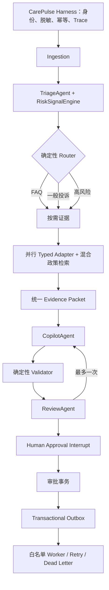

# CarePulse 技术选型需求落实与验收清单

更新日期：2026-07-31

本文把《赛题 1 技术选型重构方案》拆成可验收条目，并明确区分当前线上演示运行时与可独立部署的 Python/LangGraph 生产基线，避免把 mock adapter 或结构化 fallback 误写成已经接通的外部系统。

## 1. 验收结论

- ✅ 黑客松 MVP 的必做业务链路已闭环：理解、风险、证据、建议、审查、人工批准、Outbox。
- ✅ 线上站点使用同源 REST + SSE + D1 Edge Harness，支持身份、会话隔离、脱敏、幂等、Artifact、Trace、双层审批、Outbox 重试/死信和动态风险看板。
- ✅ 仓库内提供 Python 3.11 + FastAPI + LangGraph + PostgreSQL/pgvector 的生产运行基线，包含持久化 Checkpoint、`interrupt()` / `Command(resume=...)`、Alembic、混合检索和独立 Worker。
- ✅ 真实 CRM、OMS、模型 API 和通知渠道保持 Typed Adapter 边界；Hosted Edge 已接入 Triage/Copilot/Review 三套严格 JSON Schema 模型调用，未配置外部凭据或调用失败时使用确定性结构化 fallback / mock adapter，绝不伪装成模型或外部动作已执行。
- ✅ MVP 明确不引入开放式 ReAct、黑板 claim 调度、同质 Agent fork、MCP、Redis 主存储、LoRA/SFT/RL。

## 2. 两个运行 Profile

| Profile | 用途 | 已实现能力 | 明确边界 |
| --- | --- | --- | --- |
| Hosted Edge | 当前线上可直接验收 | React 工作台、开放输入、同源 API、SSE、D1、Artifact、Trace、身份与行级过滤、人工审批、Transactional Outbox、Worker drain、重试/死信、动态看板、60 案例评测 | 三个 Agent 在配置密钥后调用同一模型的独立 JSON Schema；未配置或失败时明确显示 SAFE FALLBACK；外部 CRM/OMS/通知仅创建幂等受控任务 |
| Python Production | Docker Compose 私有化/生产基线 | FastAPI、LangGraph StateGraph、PostgreSQL、pgvector、FTS、元数据过滤、Checkpoint、Alembic、JWT/RBAC、Outbox Worker、OTel/Prometheus | 需要部署方提供 PostgreSQL、JWT secret、真实模型与业务系统 adapter |

当前线上页不会声称“LangGraph 正在云端执行”；页面将 D1 线上运行时与 LangGraph/PostgreSQL 生产 Profile 分开呈现。

## 3. 产品定义与界面

| 原需求 | 状态 | 验收位置 |
| --- | --- | --- |
| 定位为“证据驱动的消费者共情客服 Copilot” | ✅ | `README.md`、工作台标题与交互 |
| 输出问题理解、事实/政策证据、风险提示、建议回复与动作 | ✅ | `app/page.tsx` 三栏工作台 |
| 风险看板是同一运行链路的聚合视图 | ✅ | `GET /api/v1/dashboard` 从 `service_cases`、审批和 Outbox 聚合 |
| 三条演示路径：FAQ、重复退款、不良反应/舆情 | ✅ | `app/page.tsx` 场景切换与两套 Harness 测试 |
| 人工接受、编辑、拒绝、升级 | ✅ | 工作台审批区与审批 API |
| 客服请求主管、主管最终升级 | ✅ 增强项 | `REQUEST_ESCALATION` → `PENDING_SUPERVISOR_APPROVAL` → `ESCALATE` |
| 看板趋势、问题类型、待审批、升级队列、动作/死信 | ✅ | D1 动态聚合、刷新与 CSV 导出 |
| 评委随机输入与非脚本化验证 | ✅ 增强项 | 工作台 `JUDGE CHALLENGE` 现场输入，复用同一 Run/SSE/审批链路 |
| 比赛级评测证据 | ✅ 增强项 | `GET /api/v1/evaluation` 在线复算 60 条匿名化美妆客服 fixture 与固定模板基线 |

## 4. Agent 与确定性服务边界

| 模块 | 状态 | 边界与证据 |
| --- | --- | --- |
| TriageAgent | ✅ | 只输出 intent、issue、entities、required evidence、missing fields、confidence |
| CopilotAgent | ✅ | 只生成摘要、目标、草稿、建议动作、证据引用、不确定性 |
| ReviewAgent | ✅ | 独立检查证据、政策、风险与承诺；输出 violations 和 revision flag |
| 一次自动修订上限 | ✅ | LangGraph `review → revise → review`，`revision_count < 1` |
| RiskSignalEngine | ✅ | 硬规则优先、风险取最高；异常 fail-closed 为 `REVIEW_REQUIRED` |
| EvidenceService | ✅ | 订单/历史/承诺 typed read adapter 并行 fan-out；生产政策检索接 PostgreSQL |
| ToolPolicyService | ✅ | 白名单、风险、权限、主管要求和批准动作校验 |
| CaseWorkflowService | ✅ | 代码定义决策目标与允许状态转换，不从对话文本猜状态 |
| Agent 不直接执行副作用 | ✅ | Agent 只建议；批准事务后才写 Outbox |

核心实现：

- `backend/app/orchestrator.py`
- `backend/app/services.py`
- `backend/app/harness.py`
- `app/lib/edge-harness.ts`

## 5. 有界图、Harness 与人工停点



Harness 已覆盖：

1. 身份与角色；
2. `original_input` 与 `sanitized_input` 分离；
3. 按 owner 的案例隔离；
4. 输入哈希与请求幂等；
5. 调用有界图或线上结构化 fallback；
6. 保存 triage/risk/evidence/copilot/review Artifact；
7. 保存 Run Trace、prompt/model/input hash、证据和 validator 信息；
8. 人工审批与 CAS 单次领取；
9. ToolPolicy 计划；
10. case、approval、outbox 同事务写入；
11. SSE 事件、事件 ID、心跳、游标恢复和轮询降级。

## 6. 数据、RAG 与记忆

| 原需求 | 状态 | 实现 |
| --- | --- | --- |
| PostgreSQL + pgvector | ✅ Production Profile | `backend/app/db_models.py`、Docker `pgvector/pgvector:pg16` |
| SQLAlchemy 2 + Alembic | ✅ | `backend/alembic`；API 启动前执行 `alembic upgrade head` |
| 业务、审计、Trace、Artifact、审批、Outbox 同库 | ✅ | SQLAlchemy 模型和 Alembic 初始迁移 |
| 政策文档、条款元数据与向量 | ✅ | `policy_documents`、`policy_chunks`、1536 维向量与种子政策 |
| PostgreSQL FTS + pgvector 融合 | ✅ | `PolicyRetriever` 中 0.45 lexical + 0.55 dense |
| Metadata Filter | ✅ | APPROVED、CN、ONLINE、有效期、evidence type |
| 应用层选择 / rerank | ✅ MVP | 按综合分数召回，再按必需 evidence type 选择；Cross-Encoder 保持可选 |
| 交易事实不走 RAG | ✅ | 订单/历史/承诺来自 typed adapter |
| 不建立永久情绪画像 | ✅ | 只保存可验证服务事实与风险事件，不保存“易怒”等人格标签 |
| Redis 可选，不作主库 | ✅ 架构约束 | MVP 未引入 Redis |

线上 D1 是 Hosted Edge Profile 的持久化实现，不替代 PostgreSQL Production Profile。

## 7. REST、SSE、审批与副作用

| 原需求 | 状态 | 验收方式 |
| --- | --- | --- |
| `POST /api/v1/runs` | ✅ | 严格输入类型、身份、脱敏、幂等 |
| `GET /api/v1/runs/{id}` | ✅ | owner/主管范围过滤 |
| `GET /api/v1/runs/{id}/events` | ✅ | SSE、`id`、`Last-Event-ID`、心跳、Abort |
| `GET /api/v1/evaluation` | ✅ | 在线复算 60 条案例，返回指标、场景切片、方法与诚实边界 |
| `POST /api/v1/cases/{id}/approval` | ✅ | 接受、编辑、拒绝、升级与主管复核 |
| 未批准不产生副作用 | ✅ | Outbox 仅由审批事务创建 |
| Transactional Outbox | ✅ | case + approval + outbox 原子提交 |
| 幂等执行 | ✅ | outbox/action execution 唯一幂等键 |
| 并发领取 | ✅ | Edge CAS；PostgreSQL `FOR UPDATE SKIP LOCKED` |
| 重试与指数退避 | ✅ | 最大 5 次 |
| Dead letter | ✅ | 超限进入 `DEAD_LETTER` 并在看板展示 |
| 外部 adapter 未配置时不假成功 | ✅ | execution 标记 `external_dispatch=false` |

## 8. Engineering Harness

自动回归现覆盖：

- Routing：FAQ、退款、产品安全和舆情高风险；
- Risk：硬规则、重复联系、超时承诺、异常 fail-closed、rule ID 可追踪；
- RAG：Recall@K、MRR、NDCG、过期政策率、错误地区率；
- Reply Grounding：引用有效性、显式诉求覆盖、禁止虚构退款/赔偿/治疗承诺；
- Tool：白名单、未批准零副作用、幂等、重试和 dead letter；
- API：身份、输入校验、owner 隔离、SSE、Trace、单次审批、双层升级和看板聚合；
- Evidence：订单与产品一致、退款进度与破损政策不串线；
- Security：手机号/邮箱/地址脱敏，原文与模型输入分离。
- Competition Eval：60 条产品咨询、标准售后、重复投诉、不良反应、舆情与证据缺失案例；输出路由准确率、高风险召回、引用有效率、承诺拦截率和安全失败率。

测试入口：

```bash
npm test
python -m pytest backend/tests -q
python -m ruff check backend/app backend/tests backend/alembic
```

## 9. 可观测性与安全

| 原需求 | 状态 | 实现 |
| --- | --- | --- |
| CarePulseRunTrace | ✅ | 节点、前后状态、真实模型别名、prompt、input hash、证据、风险、validator、延迟、Token、`fallback_used` |
| structlog | ✅ Python Profile | 结构化生命周期、运行失败和 Outbox 日志 |
| OpenTelemetry | ✅ Python Profile | `carepulse.graph.run` 手工 span，可接任意 exporter |
| Prometheus | ✅ Python Profile | 运行数和端到端延迟 `/metrics` |
| API 身份与 RBAC | ✅ | Hosted identity/D1 role；Production JWT `sub/role/exp/iss/aud` |
| 行级数据访问 | ✅ MVP | 所有 run、event、approval、dashboard 查询按 owner 过滤；主管角色可跨案例 |
| 原文与模型输入分离 | ✅ | 两列持久化且测试验证 |
| PII 脱敏 | ✅ | 手机号、邮箱、地址 |
| 工具白名单 | ✅ | Edge 与 Python Worker 双端校验 |
| API Key 不进入前端 | ✅ | 浏览器仅调用同源 API；外部 secret 由部署环境提供 |
| Agent 输出不拼接 SQL | ✅ | 固定 SQL / ORM，所有值参数绑定 |
| OAuth/OIDC、PostgreSQL RLS、字段加密与保留策略 | ⏭️ 产品化项 | 原方案明确列为产品化阶段，不冒充黑客松 MVP 已上线 |

## 10. 部署与依赖

- ✅ 前端：React 19 + TypeScript + Vite/vinext + Ant Design + ECharts。
- ✅ Hosted Edge：Sites + D1，同源 API，私有访问控制。
- ✅ Python：Python 3.11、FastAPI、Pydantic v2、LangGraph、SQLAlchemy 2、Alembic。
- ✅ Docker Compose：PostgreSQL/pgvector、API、独立 Outbox Worker、健康检查和启动依赖。
- ✅ 生产 npm 依赖审计为 0；PostCSS 与 Sharp 使用已修补版本 override。
- ✅ 数据迁移：Hosted Edge 使用 Drizzle migration；Python Profile 使用 Alembic。

## 11. 有意不做的内容

以下不是遗漏，而是遵循原方案主动排除：

- 开放式 ReAct AgentLoop；
- 五到八个 Agent 自由协商；
- ContextAgent / OrderAgent / ProductAgent 等同质 fork；
- 黑板 claim 与 Artifact 竞争调度；
- SQLite + Chroma 双主库；
- MVP 全工具 MCP 化；
- Agent 自动发送消费者回复、自动退款、赔偿或通知法务；
- 无可靠标注数据前的 LoRA、SFT 或 Agentic RL；
- 无双向协作需求时引入 WebSocket；
- Redis 作为业务主数据源。

## 12. GitHub 架构复核

本次实现对照了以下同类官方仓库的架构信号：

- [LangGraph customer-support example](https://github.com/langchain-ai/langgraph/tree/main/examples/customer-support)：保留图状态、路由和受控工具模式，不照搬开放循环。
- [LangGraph 101 production patterns](https://github.com/langchain-ai/langgraph-101)：采用 middleware / guardrail / human-in-the-loop 的职责分离。
- [OpenAI customer-service agents demo](https://github.com/openai/openai-cs-agents-demo)：参考前后端分离的客服工作台，但本项目进一步把副作用移到事务 Outbox。
- [GitHub Sharp advisory GHSA-f88m-g3jw-g9cj](https://github.com/advisories/GHSA-f88m-g3jw-g9cj)：依赖已覆盖到修复版本，避免继续部署受影响的图片处理链。

复核后的核心结论没有改变：CarePulse 的壁垒应是“受控图 + 确定性服务 + 证据链 + 人工审批 + 可恢复副作用”，而不是 Agent 数量。
